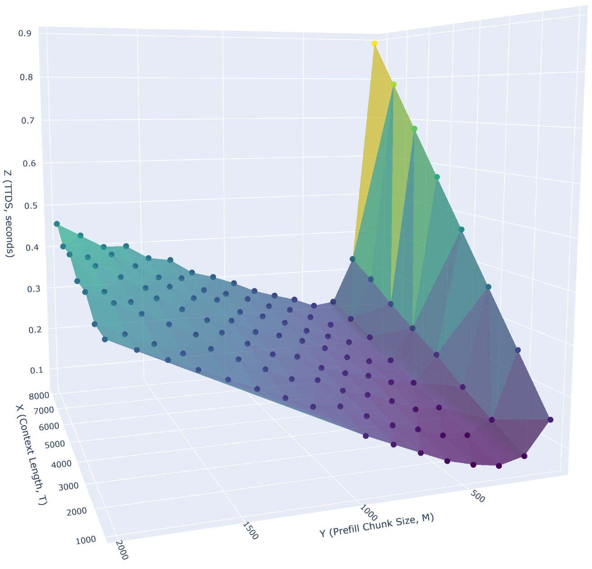
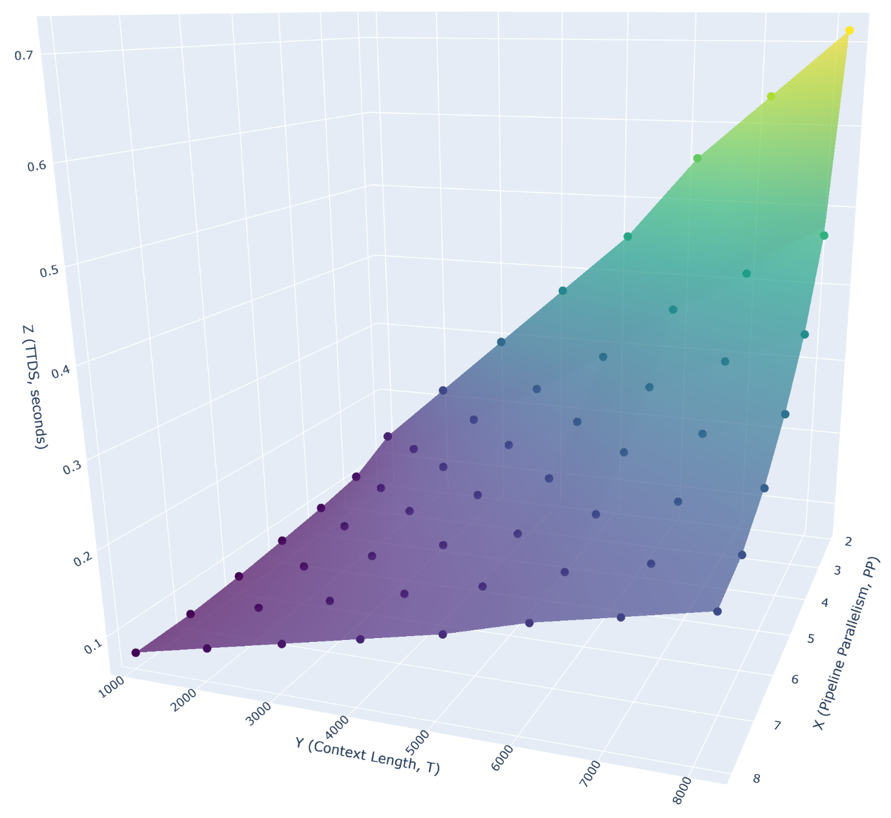
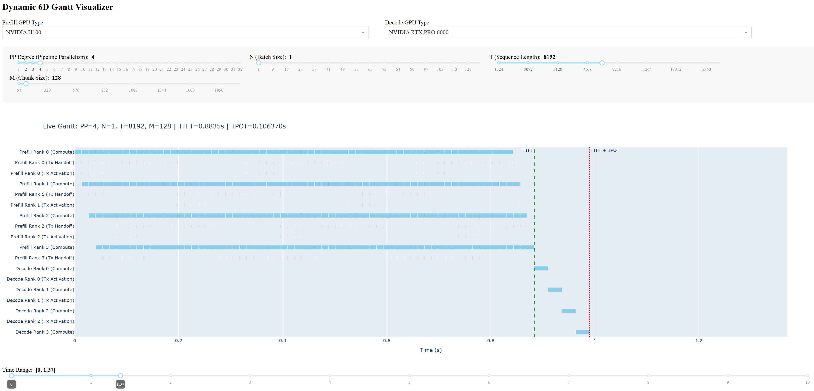
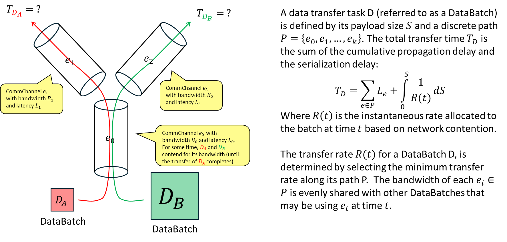
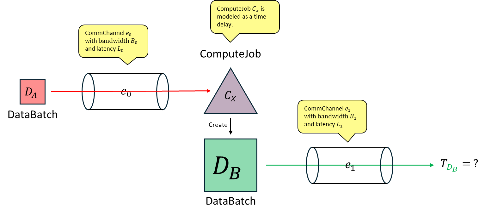
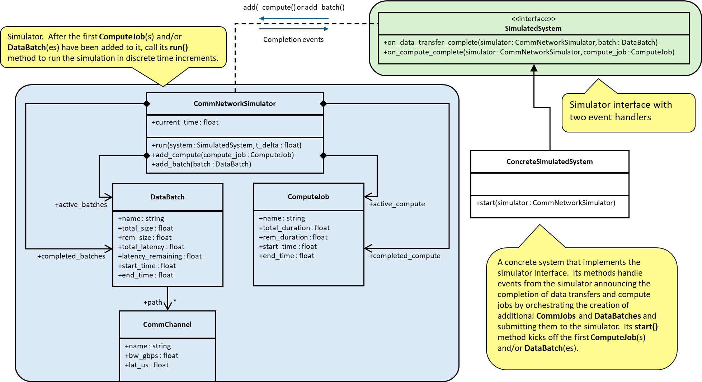
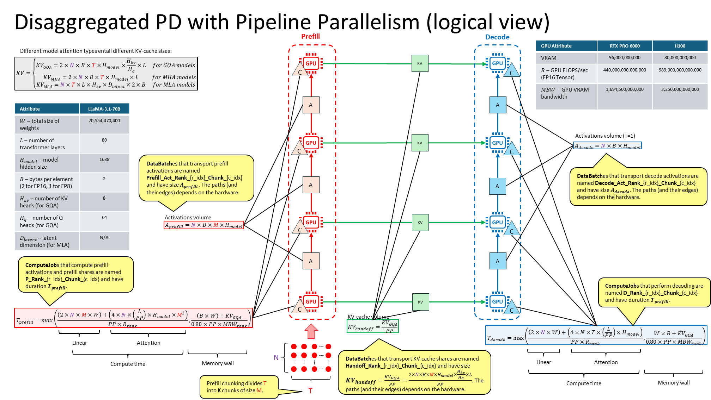
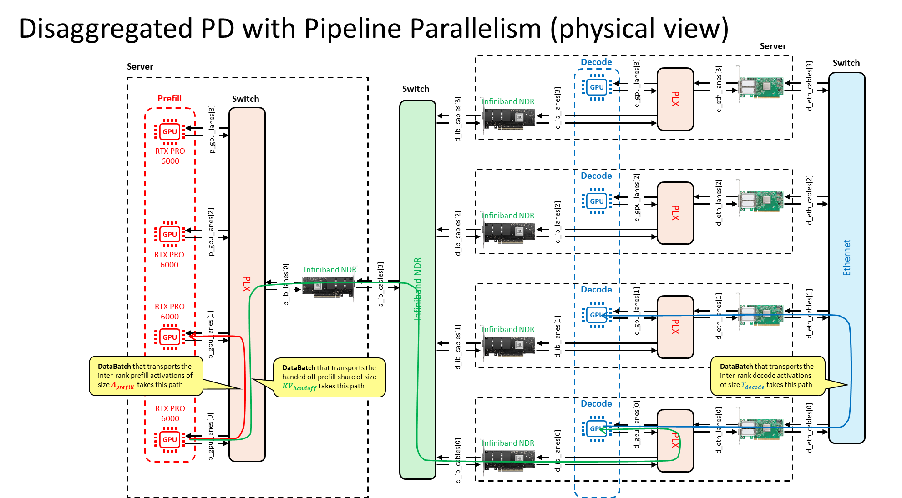

# Discrete-Event Simulator (DES) for Concurrent Communication and Computation in Distributed Systems

## Abstract

This document defines a formal framework for simulating the performance of distributed systems characterized by interleaved data movement and computational workloads such as those found in LLM systems. The framework employs a Max-Min Fairness algorithm for bandwidth allocation across shared network segments and a discrete-event callback mechanism to model complex, state-dependent operational sequences.  The main use case for this project is to facilitate the analyzis of various configurations of a disaggregated PD inference system via graphs and an interactive tool with 6 degrees of freedome.

<div align="center">
<table style="width:100%">
    <tr>
        <td></td>
        <td></td>
        <td></td>
    </tr>
</table>
</div>

---

## 1. Core Mathematical Model

### 1.1 Network Representation
A communication network is modeled as a set of edges $E$, where each edge $e \in E$ is a `CommChannel` characterized by:
- **Bandwidth ($B_e$):** Peak data transfer rate in bytes per second.
- **Latency ($L_e$):** Propagation delay in seconds.

### 1.2 Data Transfer Modeling
A data transfer task $D$ (referred to as a `DataBatch`) is defined by its payload size $S$ and a discrete path $P = \{e_1, e_2, \dots, e_k\}$. The total transfer time $T_D$ is the sum of the cumulative propagation delay and the serialization delay:

$$T_D = \sum_{e \in P} L_e + \int_{0}^{S} \frac{1}{R(t)} ds$$

where $R(t)$ is the instantaneous rate allocated to the batch at time $t$ based on network contention.

<div align="center">
    
</div>

The transfer rate $R(t)$ for a `DataBatch` $D$, is determined by selecting the minimum transfer rate along its path $P$.<br>
The bandwidth of each $e_i \in P$ is evenly shared with other `DataBatch`es that may be using $e_i$ at time $𝑡$.


### 1.3 Computational Modeling
A computation task $C$ (`ComputeJob`) is modeled as a time-delay $D_c$. Unlike data batches, computation tasks do not consume edge bandwidth but can trigger or be triggered by network events.




---

## 2. Resource Allocation: Max-Min Fairness
To resolve contention on shared edges, the simulator implements **Max-Min Fairness**. At each time step $\Delta t$, the available bandwidth of an edge $e$ is distributed such that:
1. No batch receives more than its bottleneck rate.
2. Batches with the same bottleneck are treated equally.
3. Surplus bandwidth from constrained batches is redistributed to unconstrained ones.

The rate $r_i$ for batch $i$ is determined by:
$$\text{maximize } \min_{i} (r_i) \text{ s.t. } \sum_{i \in \text{users}(e)} r_i \leq B_e, \forall e \in E$$

---

## 3. System Architecture and Interfaces



### 3.1 The SimulatedSystem Interface
The framework relies on an inversion-of-control pattern. Users must implement the `SimulatedSystem` interface to handle the lifecycle of tasks:
- **`on_data_transfer_complete(simulator, batch)`**: Invoked when a batch clears its path latency and its payload is fully serialized.  May return a `ComputeJob`, which the simulator adds to its `active_compute` set, or may add `ComputeJob`s directly.
- **`on_compute_complete(simulator, job)`**: Invoked when a computation's duration has elapsed.

### 3.2 The Simulator Engine (`CommNetworkSimulator`)
The engine maintains two active queues (`active_batches` and `active_compute`) and a historical log of completed tasks. It executes a time-stepping loop where $\Delta t$ is dynamically calculated based on the smallest significant temporal feature of the system.

---

## 4. Operational Logic
1. **Latency Phase:** A batch enters a "flight" state where `latency_remaining` decrements.
2. **Transfer Phase:** Once latency is zero, the batch participates in the Max-Min allocation.
3. **Event Triggering:** Upon completion, the simulator queries the `SimulatedSystem`. The system may inject new batches or compute jobs back into the engine, allowing for recursive workflow modeling.

---

## 5. Data Structures for Reconstruction

### DataBatch
Represents a payload traversing a set of segments.
- **Attributes**:
  - `total_size`: Size in bytes.
  - `rem_size`: Bytes remaining to be transferred.
  - `path`: An ordered list of `CommChannel` objects.
  - `latency_remaining`: Accrued propagation delay that must expire before data begins moving.
  - `start_time` / `end_time`: Timestamps for performance analysis.

### CommChannel (Edge)
Represents a physical or logical link between two points.
- **Attributes**:
  - `bandwidth_bps`: Average data rate in bytes per second.
  - `latency_s`: Propagation delay in seconds.
- **Behavior**: Used by the simulator to determine both the "flight time" (latency) and the "serialization time" (throughput) of data.

### ComputeJob
Represents a task requiring execution time on a resource without consuming network bandwidth.
- **Attributes**:
  - `total_duration`: Execution time in seconds.
  - `rem_duration`: Seconds remaining until completion.
  - `start_time` / `end_time`: Timestamps for performance analysis.

### LLM and GPU (Resource Models)
Supporting metadata classes used to derive the `total_size` for `DataBatch` or `total_duration` for `ComputeJob`.
- **GPU**: Stores VRAM capacity, memory bandwidth, and peak FLOPS.
- **LLM**: Stores model dimensions (Weights, Layers, Heads) and KV-cache calculation logic.

---

## 6. Implementation Examples

### Example 1: Simple P2P Transfer
*Goal: Model a single data transfer across a PCIe link with propagation delay.*

```python
pci = CommChannel("PCIe Gen4")
sim = CommNetworkSimulator()
batch = DataBatch("Initial_Data", 1024**3, [pci]) # 1GB
sim.add_batch(batch)

class SimpleSystem(SimulatedSystem):
    def on_data_transfer_complete(self, sim, batch):
        print(f"Transfer complete at {sim.current_time}s")
    def on_compute_complete(self, sim, job): pass

sim.run(SimpleSystem())
```

### Example 2: Competing Flows (Contention)
*Goal: Demonstrate Max-Min Fairness where a slow link prevents a user from hogging a fast link.*

```python
fast_link = CommChannel("NVLink")        # 300GB/s
slow_link = CommChannel("Ethernet 100G") # 100GB/s

# Batch A uses the fast link only
# Batch B uses the fast link AND the slow link
sim = CommNetworkSimulator()
sim.add_batch(DataBatch("User_A", 10**9, [fast_link]))
sim.add_batch(DataBatch("User_B", 10**9, [fast_link, slow_link]))

# Behavior: User_B is bottlenecked by the slow_link. 
# Max-Min gives User_A the remaining slack on fast_link.
sim.run(SilentSystem())
```

### Example 3: The Data-Compute Loop
*Goal: Model a GPU processing a received batch and then sending results.*
```python
class RecursiveSystem(SimulatedSystem):
    def on_data_transfer_complete(self, sim, batch):
        if batch.name == "Inputs":
            # Start a compute job (0.1s duration)
            return ComputeJob("GPU_Kernel", 0.1)
            
    def on_compute_complete(self, sim, job):
        if job.name == "GPU_Kernel":
            # Send results back
            sim.add_batch(DataBatch("Results", 10**6, [pci]))

sim = CommNetworkSimulator()
sim.add_batch(DataBatch("Inputs", 10**7, [pci]))
sim.run(RecursiveSystem())
```

### Example 4: Multi-Stage Pipeline
*Goal: Model a multi-hop pipeline where data passes through various mediums (PCIe -> InfiniBand -> Ethernet).*

```python
pci = CommChannel("PCIe Gen4")
ib = CommChannel("Infiniband NDR")
eth = CommChannel("Ethernet 100G")

class PipelineSystem(SimulatedSystem):
    def on_data_transfer_complete(self, sim, batch):
        if "Stage_1" in batch.name:
            sim.add_batch(DataBatch("Stage_2", batch.total_size, [ib]))
        elif "Stage_2" in batch.name:
            return ComputeJob("Final_Agg", 0.05)
    def on_compute_complete(self, sim, job):
        print("Pipeline sequence finished.")

sim = CommNetworkSimulator()
sim.add_batch(DataBatch("Stage_1", 5*10**8, [pci]))
sim.run(PipelineSystem())
```

## 7. Disaggregated PD Systems with Pipeline Parallelism
This section formalizes the principal use case of the simulator: the quantitative analysis of disaggregated pipeline-parallel (PP) LLM inference systems. The framework enables systematic exploration of system configurations through graphical outputs and interactive tools supporting six degrees of freedom. Both logical and physical abstractions are employed to accurately model and simulate the operational characteristics of the disaggregated PD system.

### Logical View
The logical view models the system in terms of the dimensionality and partitioning of `DataBatch` and `ComputeJob` objects. For example, a configuration with $\mathrm{PP}=4$ executing an LLM with group query attention (GQA) is illustrated below:


### Physical View
The physical view describes the explicit transport paths and constituent edges traversed by each `DataBatch`. For clarity, the diagram below omits the distinction between full-duplex communication channels, which in a rigorous model would be represented as separate `CommChannel` instances for each direction.


### DisaggregatedPDSystemPP
The class `DisaggregatedPDSystemPP` implements the `start()` method, which creates the initial `ComputeJob` for the GPU of rank 0 in the prefill pipeline to kick-off the prefill process.  After that, a call to `CommNetworkSimulator.run()` starts the simulation.

`DisaggregatedPDSystemPP` realizes the `SimulatedSystem` interface in order to receive calls to `on_compute_complete()` and `on_data_transfer_complete()` announcing the completion of `ComputeJob`s and `DataBatch` transfers.  `DisaggregatedPDSystemPP` handles these calls by creating addditional `ComputeJob`s and/or `DataBatch`es in order to orchestrate the disaggregated PD system's behavior.

After the simuation completes, the user may access the start/time of each completed `ComputeJob` and `DataBatch` transfer via `CommNetworkSimulator.completed_compute[]` and `CommNetworkSimulator.completed_batches[]` in order to analyze the performance of the simulated system.

### Analysis through Visualization
To enable rigorous post-simulation analysis, the framework provides visualization modules that generate three-dimensional charts depicting the time to decode start (TTDS) as a function of key system parameters. In addition, an interactive Gantt chart visualizes the temporal evolution of all `ComputeJob` and `DataBatch` events, supporting detailed investigation of concurrency and resource allocation. The Gantt chart interface exposes six principal system parameters for user-driven exploration:
- Prefill GPU type (e.g. `NVIDIA H100`, `NVIDIA RTX PRO 6000`, `AMD Instinct MI300A`, etc)
- Decode GPU type (e.g. `NVIDIA H100`, `NVIDIA RTX PRO 6000`, `AMD Instinct MI300A`, etc)
- Pipeline parallelism degree (PP)
- Batch size ($N$)
- Sequence length ($T$)
- Prefill chunk size ($M$)

> **Limitation:** The present implementation permits independent specification of the pipeline parallelism degree ($\mathrm{PP}$) for both the prefill and decode pipelines. However, in a rigorous system, the decode pipeline should employ two-dimensional parallelism — specifically, a combination of pipeline parallelism ($\mathrm{PP}$) and tensor parallelism ($\mathrm{TP}$). Optimal performance requires that the degrees of $\mathrm{PP}$ and $\mathrm{TP}$ for the decode stage be selected jointly, reflecting the physical constraints and workload characteristics of the system.

#### Time to Decode Start (TTDS) Sensitivity to Prefill Chunking Chunk Size (M) and Context Length (T)
The `MTSweepVisualizer` module systematically explores the impact of prefill chunk size ($M$) and context length ($T$) on the time to decode start (TTDS) in disaggregated LLM inference systems. By varying $M$ and $T$ across a user-defined grid, the visualizer generates 3D surface plots that reveal the interplay between chunking granularity and sequence length, as well as the sensitivity to variations in each. This analysis enables identification of optimal chunk sizes for minimizing TTDS under different workload scenarios, providing actionable insights for system configuration and scheduling.

`MTSweepVisualizer` generate `M_T_TTDS_sweep_3d.html`, which the user may load in a browser to display and manipulate the 3D graph.


#### Time to Decode Start (TTDS) Sensitivity to Pipeline Parallelism Degree (PP) and Context Length (T)
The `PPTSweepVisualizer` module investigates how the degree of pipeline parallelism ($\mathrm{PP}$) and context length ($T$) jointly affect TTDS. By sweeping $\mathrm{PP}$ and $T$ parameters, the tool produces visualizations that elucidate the trade-offs between increased parallelism and sequence processing latency. These results inform the selection of pipeline depth and context window size to achieve desired latency targets, supporting principled design of scalable inference architectures.

`PPTSweepVisualizer` generate `PP_T_TTDS_sweep_3d.html`, which the user may load in a browser to display and manipulate the 3D graph.


#### Interactive 6D Gantt Chart
The `Gantt6DVisualizer` provides an interactive, high-dimensional visualization environment for analyzing the temporal dynamics of disaggregated LLM inference systems. This tool renders a Gantt chart that encodes the start and end times of all `ComputeJob` and `DataBatch` events, enabling detailed inspection of system concurrency and resource utilization. Users can manipulate six key system parameters—prefill GPU type, decode GPU type, pipeline parallelism degree (PP), batch size (N), sequence length (T), and prefill chunk size (M)—in real time. The visualizer computes and displays key performance metrics, including Time to Decode Start (TTDS), Time to First Token (TTFT), and Time per Output Token (TPOT), directly from the simulated event traces. This facilitates comprehensive scenario exploration, bottleneck identification, and sensitivity analysis of latency to various system parameters, making the tool a powerful instrument for both qualitative and quantitative performance evaluation.

The `Gantt6DVisualizer` implements a webapp running in a local server to which the user may connect via a browser in order to use the tool.


