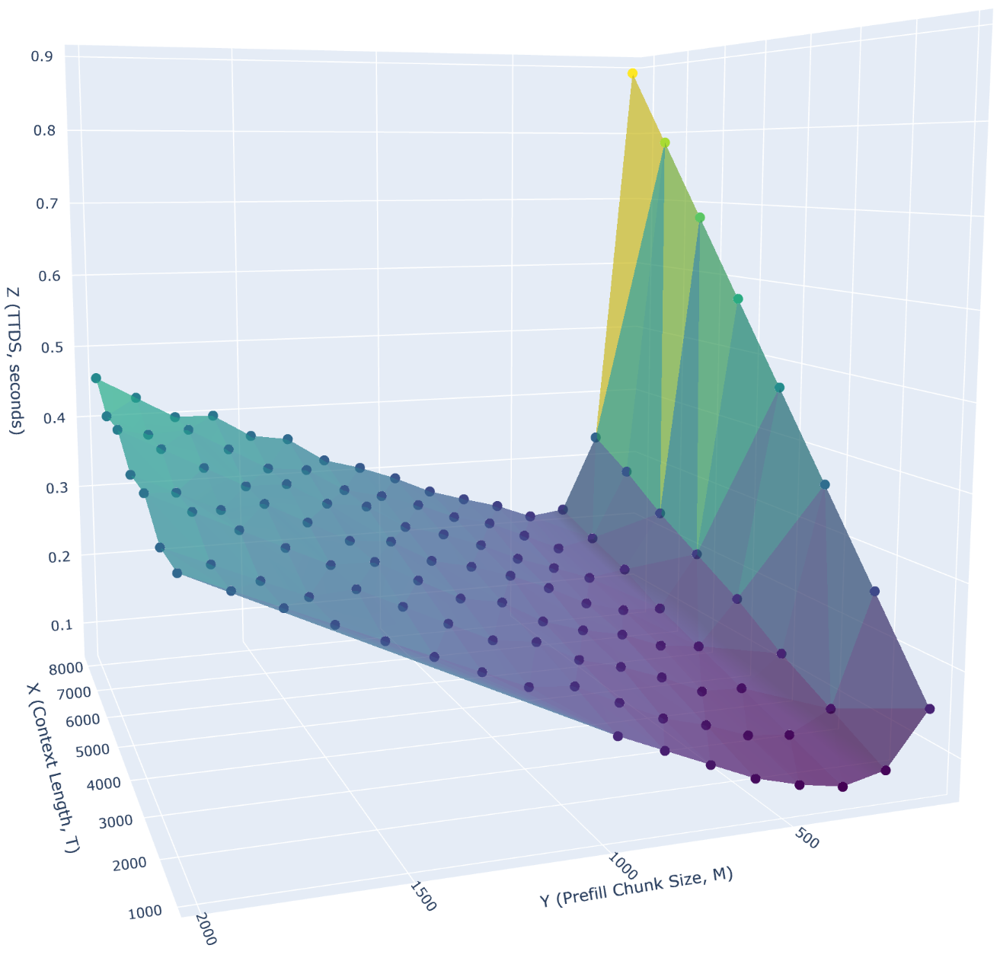
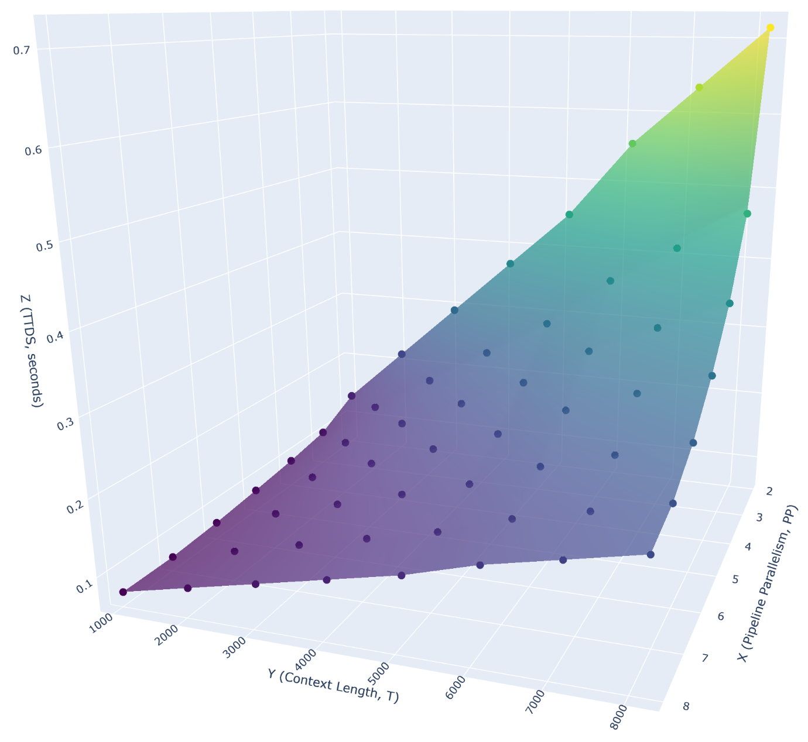
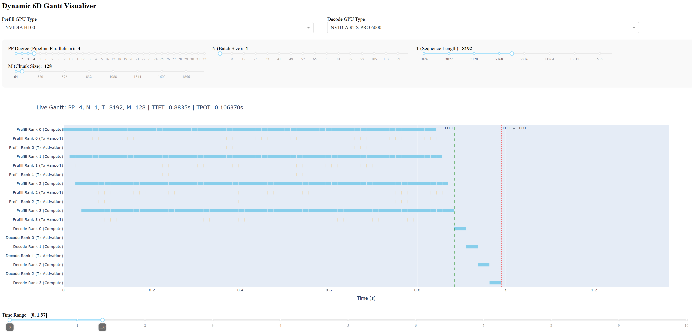
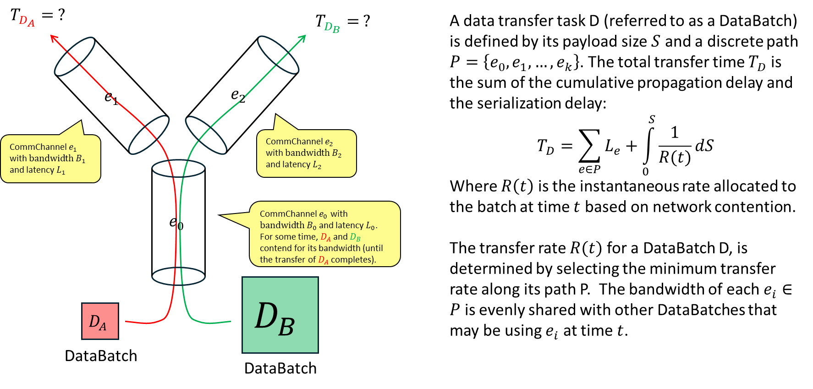
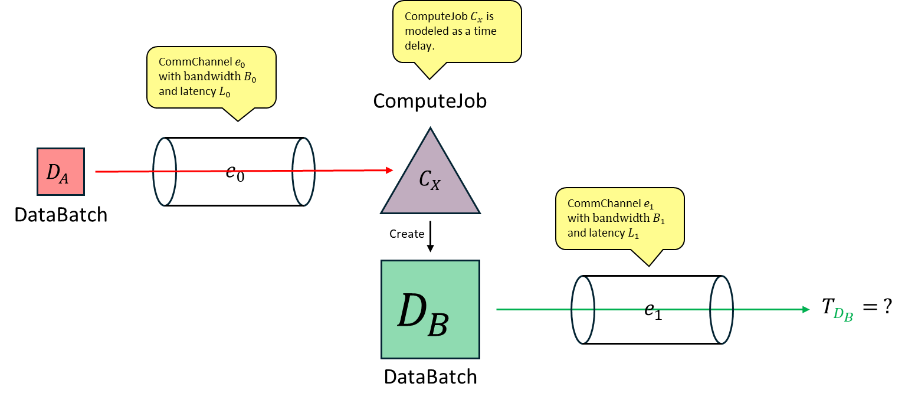
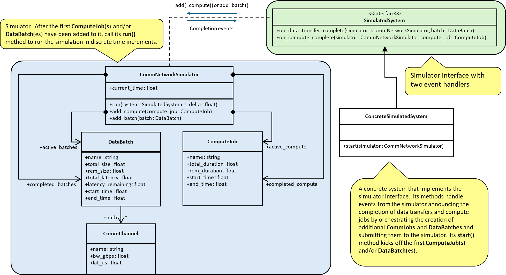

# Discrete-Event Simulation (DES) of Concurrent Communication and Computation in Distributed Systems

## Abstract

This document defines a formal framework for simulating the performance of distributed systems characterized by interleaved data movement and computational workloads such as those found in LLM systems. The framework employs a Max-Min Fairness algorithm for bandwidth allocation across shared network segments and a discrete-event callback mechanism to model complex, state-dependent operational sequences.  The main use case for this project is to facilitate the analyzis of various configurations of a disaggregated PD inference system via graphs and an interactive tool with 6 degrees of freedome.

<table style="width:100%">
    <tr>
        <td></td>
        <td></td>
        <td></td>
    </tr>
</table>


---

## 1. Core Mathematical Model

### 1.1 Network Representation
A communication network is modeled as a set of edges $E$, where each edge $e \in E$ is a `CommChannel` characterized by:
- **Bandwidth ($B_e$):** Peak data transfer rate in bytes per second.
- **Latency ($L_e$):** Propagation delay in seconds.

### 1.2 Data Transfer Modeling
A data transfer task $D$ (referred to as a `DataBatch`) is defined by its payload size $S$ and a discrete path $P = \{e_1, e_2, \dots, e_k\}$. The total transfer time $T_D$ is the sum of the cumulative propagation delay and the serialization delay:
$$T_D = \sum_{e \in P} L_e + \int_{0}^{S} \frac{1}{R(t)} ds$$
where $R(t)$ is the instantaneous rate allocated to the batch at time $t$ based on network contention.



### 1.3 Computational Modeling
A computation task $C$ (`ComputeJob`) is modeled as a time-delay $D_c$. Unlike data batches, computation tasks do not consume edge bandwidth but can trigger or be triggered by network events.




---

## 2. Resource Allocation: Max-Min Fairness
To resolve contention on shared edges, the simulator implements **Max-Min Fairness**. At each time step $\Delta t$, the available bandwidth of an edge $e$ is distributed such that:
1. No batch receives more than its bottleneck rate.
2. Batches with the same bottleneck are treated equally.
3. Surplus bandwidth from constrained batches is redistributed to unconstrained ones.

The rate $r_i$ for batch $i$ is determined by:
$$\text{maximize } \min_{i} (r_i) \text{ s.t. } \sum_{i \in \text{users}(e)} r_i \leq B_e, \forall e \in E$$

---

## 3. System Architecture and Interfaces



### 3.1 The SimulatedSystem Interface
The framework relies on an inversion-of-control pattern. Users must implement the `SimulatedSystem` interface to handle the lifecycle of tasks:
- **`on_data_transfer_complete(simulator, batch)`**: Invoked when a batch clears its path latency and its payload is fully serialized.  May return a `ComputeJob`, which the simulator adds to its `active_compute` set, or may add `ComputeJob`s directly.
- **`on_compute_complete(simulator, job)`**: Invoked when a computation's duration has elapsed.

### 3.2 The Simulator Engine (`CommNetworkSimulator`)
The engine maintains two active queues (`active_batches` and `active_compute`) and a historical log of completed tasks. It executes a time-stepping loop where $\Delta t$ is dynamically calculated based on the smallest significant temporal feature of the system.

---

## 4. Operational Logic
1. **Latency Phase:** A batch enters a "flight" state where `latency_remaining` decrements.
2. **Transfer Phase:** Once latency is zero, the batch participates in the Max-Min allocation.
3. **Event Triggering:** Upon completion, the simulator queries the `SimulatedSystem`. The system may inject new batches or compute jobs back into the engine, allowing for recursive workflow modeling.

---

## 5. Data Structures for Reconstruction

### DataBatch
Represents a payload traversing a set of segments.
- **Attributes**:
  - `total_size`: Size in bytes.
  - `rem_size`: Bytes remaining to be transferred.
  - `path`: An ordered list of `CommChannel` objects.
  - `latency_remaining`: Accrued propagation delay that must expire before data begins moving.
  - `start_time` / `end_time`: Timestamps for performance analysis.

### CommChannel (Edge)
Represents a physical or logical link between two points.
- **Attributes**:
  - `bandwidth_bps`: Average data rate in bytes per second.
  - `latency_s`: Propagation delay in seconds.
- **Behavior**: Used by the simulator to determine both the "flight time" (latency) and the "serialization time" (throughput) of data.

### ComputeJob
Represents a task requiring execution time on a resource without consuming network bandwidth.
- **Attributes**:
  - `total_duration`: Execution time in seconds.
  - `rem_duration`: Seconds remaining until completion.
  - `start_time` / `end_time`: Timestamps for performance analysis.

### LLM and GPU (Resource Models)
Supporting metadata classes used to derive the `total_size` for `DataBatch` or `total_duration` for `ComputeJob`.
- **GPU**: Stores VRAM capacity, memory bandwidth, and peak FLOPS.
- **LLM**: Stores model dimensions (Weights, Layers, Heads) and KV-cache calculation logic.

---

## 6. Implementation Examples

### Example 1: Simple P2P Transfer
*Goal: Model a single data transfer across a PCIe link with propagation delay.*

```python
pci = CommChannel("PCIe Gen4")
sim = CommNetworkSimulator()
batch = DataBatch("Initial_Data", 1024**3, [pci]) # 1GB
sim.add_batch(batch)

class SimpleSystem(SimulatedSystem):
    def on_data_transfer_complete(self, sim, batch):
        print(f"Transfer complete at {sim.current_time}s")
    def on_compute_complete(self, sim, job): pass

sim.run(SimpleSystem())
```

### Example 2: Competing Flows (Contention)
*Goal: Demonstrate Max-Min Fairness where a slow link prevents a user from hogging a fast link.*

```python
fast_link = CommChannel("NVLink") # 300GB/s
slow_link = CommChannel("Ethernet 100G") # 10GB/s

# Batch A uses the fast link only
# Batch B uses the fast link AND the slow link
sim = CommNetworkSimulator()
sim.add_batch(DataBatch("User_A", 10**9, [fast_link]))
sim.add_batch(DataBatch("User_B", 10**9, [fast_link, slow_link]))

# Behavior: User_B is bottlenecked by the slow_link. 
# Max-Min gives User_A the remaining slack on fast_link.
sim.run(SilentSystem())
```

### Example 3: The Data-Compute Loop
*Goal: Model a GPU processing a received batch and then sending results.*
```python
class RecursiveSystem(SimulatedSystem):
    def on_data_transfer_complete(self, sim, batch):
        if batch.name == "Inputs":
            # Start a compute job (0.1s duration)
            return ComputeJob("GPU_Kernel", 0.1)
            
    def on_compute_complete(self, sim, job):
        if job.name == "GPU_Kernel":
            # Send results back
            sim.add_batch(DataBatch("Results", 10**6, [pci]))

sim = CommNetworkSimulator()
sim.add_batch(DataBatch("Inputs", 10**7, [pci]))
sim.run(RecursiveSystem())
```

### Example 4: Multi-Stage Pipeline (HPC)
*Goal: Model a multi-hop pipeline where data passes through various mediums (PCIe -> InfiniBand -> Ethernet).*

```python
pci = CommChannel("PCIe Gen4")
ib = CommChannel("Infiniband NDR")
eth = CommChannel("Ethernet 100G")

class PipelineSystem(SimulatedSystem):
    def on_data_transfer_complete(self, sim, batch):
        if "Stage_1" in batch.name:
            sim.add_batch(DataBatch("Stage_2", batch.total_size, [ib]))
        elif "Stage_2" in batch.name:
            return ComputeJob("Final_Agg", 0.05)
    def on_compute_complete(self, sim, job):
        print("Pipeline sequence finished.")

sim = CommNetworkSimulator()
sim.add_batch(DataBatch("Stage_1", 5*10**8, [pci]))
sim.run(PipelineSystem())
```

